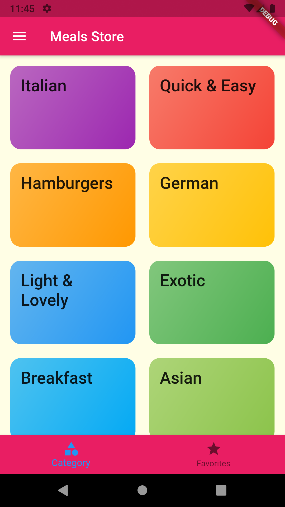
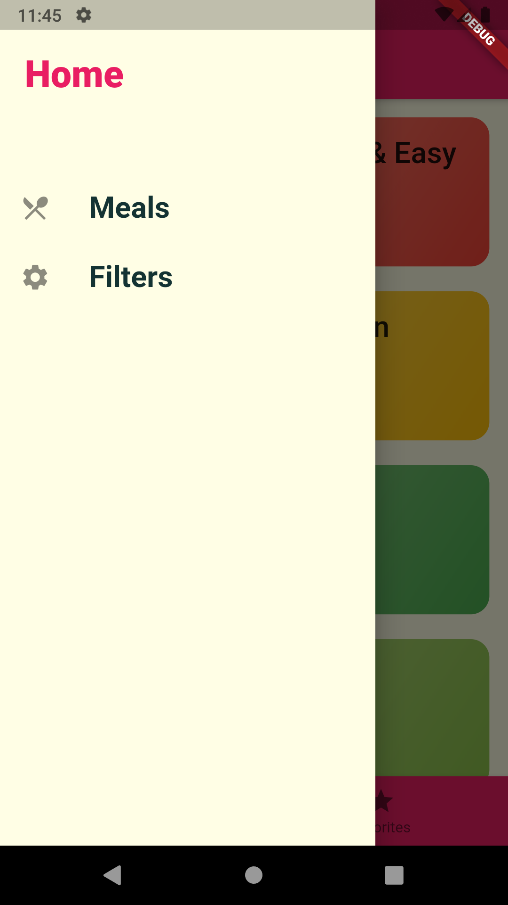
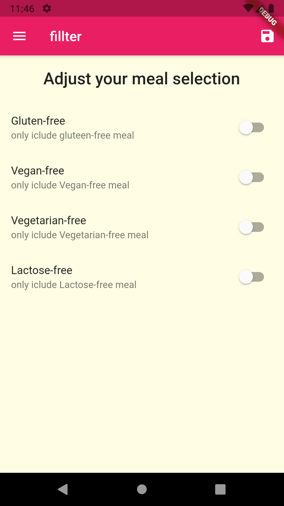
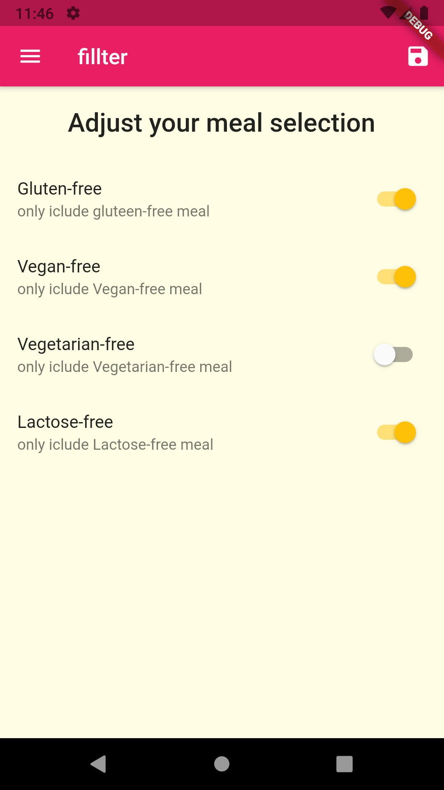
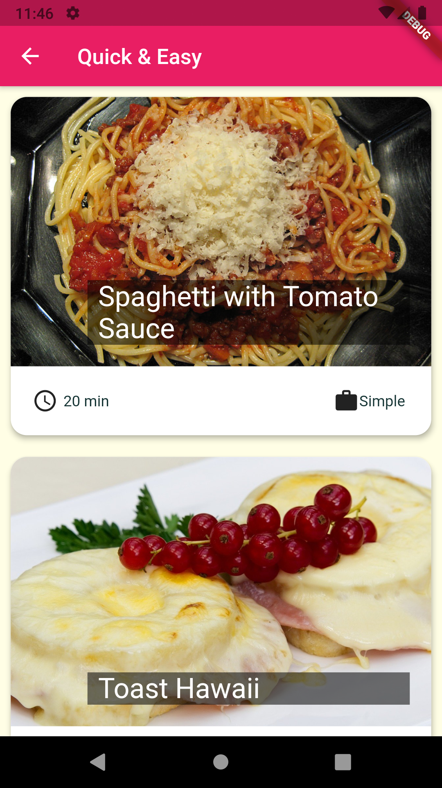
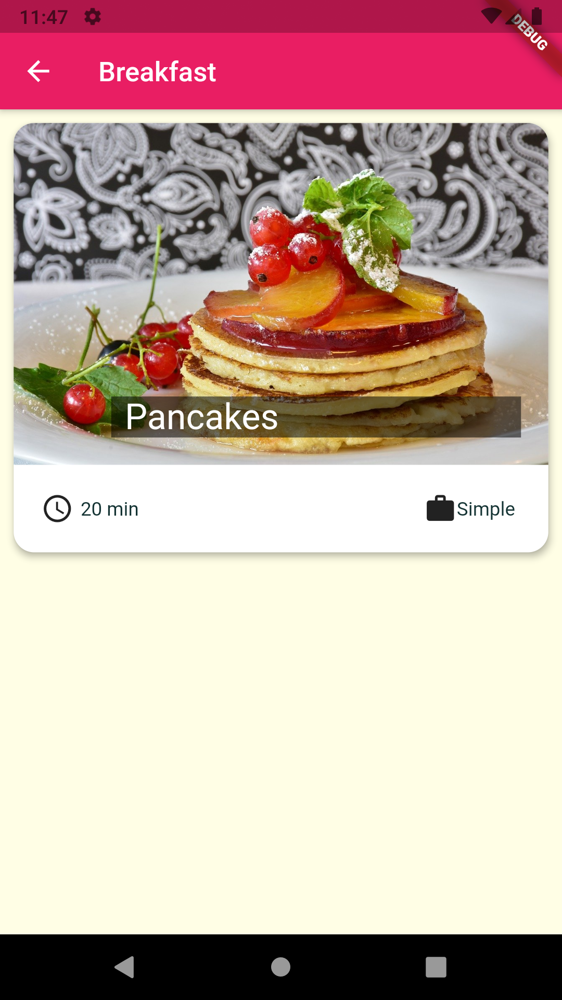
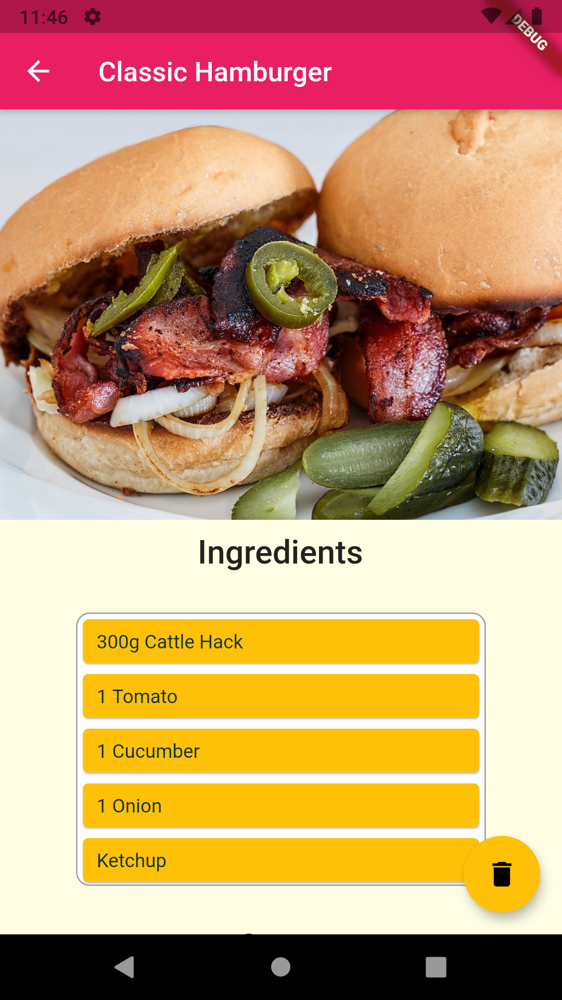
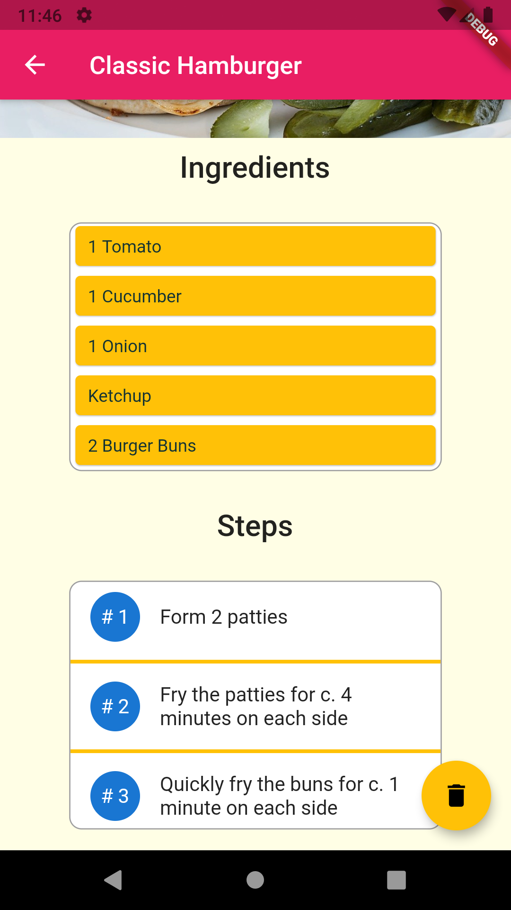

# meals_app

A new Flutter project. that i make to learn the flutter  and the Dart language base on udemy course named *** Flutter & Dart - The Complete Guide 2021 Edition ***

## what do i learn by building this project ?
1. styling the Widget and make the themes
2. alot of Widget like 
  
  * IconButton
  * BottomNavigationBar
  * Grid list
  
3. navigation inside flutter 
4. routse system inside flutter  
5. passing  data  front back 
6. create globle theme

# Image

### still to go later ,
1. favorite screen 
2. auth 
3. add backend server and databace 

